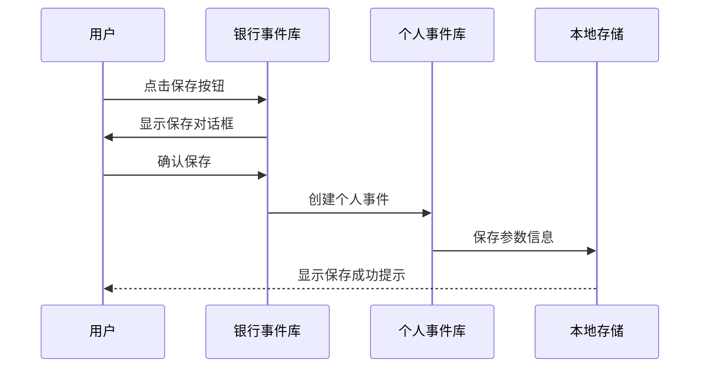
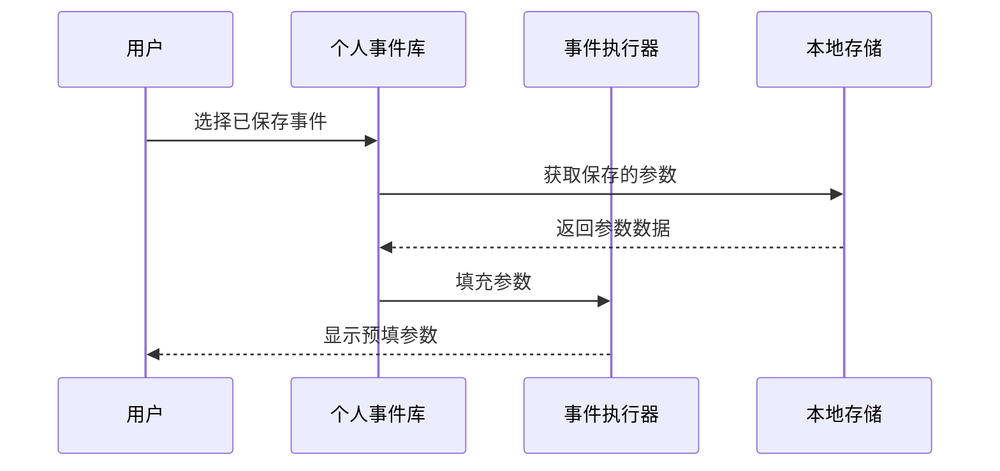

# 银行事件管理系统设计文档

## 系统概述
本系统是一个银行事件管理平台，采用分层设计，通过标准事件库、银行事件库和个人事件库三个层次来实现事件的组合和管理。系统支持事件的创建、编辑、删除和执行，并提供实时反馈和状态提示。

## 核心功能模块

### 1. 事件库架构
- **标准事件库**：基础事件库，包含所有原子操作
- **银行事件库**：由标准事件组合而成的银行级事件
- **个人事件库**：由银行事件组合而成的个人定制事件
- **组合关系**：支持多对多的组合关系，确保事件的灵活组合

### 2. 个人事件库功能
#### 2.1 搜索功能
- 实时搜索：支持实时过滤显示匹配的事件
- 搜索范围：事件名称的模糊匹配
- 搜索开关：可通过右上角按钮切换搜索框显示状态

#### 2.2 新建功能
- 事件名称：支持自定义个人事件名称
- 银行事件选择：
  - 搜索选择：支持搜索和选择银行事件
  - 顺序调整：支持拖拽调整选中事件的执行顺序
  - 参数设置：支持为选中的事件配置参数

#### 2.3 编辑功能
- 事件修改：支持修改事件名称和组合内容
- 组合调整：支持调整事件组合和执行顺序
- 实时保存：修改后自动保存到本地存储

#### 2.4 删除功能
- 删除确认：显示删除确认对话框
- 组合预览：显示待删除事件的组合内容
- 依赖检查：检查是否有其他事件依赖于待删除事件

### 3. 银行事件库功能
#### 3.1 搜索功能
- 实时搜索：支持实时过滤显示匹配的事件
- 搜索范围：事件名称和描述的模糊匹配
- 搜索开关：可通过右上角按钮切换搜索框显示状态

#### 3.2 新建功能
- 基本信息：
  - 事件名称：支持自定义银行事件名称
  - 事件描述：支持添加详细描述
- 标准事件选择：
  - 搜索选择：支持搜索和选择标准事件
  - 顺序调整：支持拖拽调整选中事件的执行顺序
  - 参数配置：支持为每个标准事件配置参数

#### 3.3 编辑功能
- 信息修改：支持修改事件名称、描述和组合内容
- 组合调整：支持调整标准事件组合和执行顺序
- 参数修改：支持修改各个标准事件的参数
- API同步：修改后自动同步到服务器

#### 3.4 删除功能
- 删除确认：显示删除确认对话框
- 依赖检查：检查是否有个人事件依赖该银行事件
- 组合预览：显示待删除事件的组合内容

#### 3.5 保存功能
- **功能描述**：
  - 在银行事件执行前，允许用户将当前事件保存到个人事件库
  - 用户可以在确认所有参数正确后再执行事件
  - 保存的事件会包含当前所有的参数信息

- **交互流程**：
  1. 在银行事件的设置参数弹窗区域添加"保存"按钮
  2. 点击保存按钮后将事件保存到个人事件库

- **数据处理**：
  - 保存时记录当前事件的所有参数
  - 在个人事件库中可以查看和编辑这些参数
  - 执行时自动填充已保存的参数

- **用户体验**：
  - 保存按钮使用文字表示
  - 保存成功后显示提示信息
  - 可以在个人事件库中快速找到已保存的事件

- **错误处理**：
  - 如果事件名称重复，提示用户修改
  - 保存失败时提供重试选项
  - 显示具体的错误原因

#### 3.6 参数管理
- **参数存储**：
  ```typescript
  interface SavedEventParams {
    eventId: string;
    eventName: string;
    parameters: {
      [key: string]: string;
    };
    lastModified: string;
    description?: string;
  }
  ```

- **本地存储结构**：
  ```typescript
  interface LocalStorageData {
    savedEvents: {
      [eventId: string]: SavedEventParams;
    };
    lastUsedParams: {
      [eventId: string]: {
        [paramName: string]: string;
      };
    };
  }
  ```

### 4. 标准事件库功能
#### 4.1 搜索功能
- 实时搜索：支持实时过滤显示匹配的事件
- 搜索范围：事件名称和描述的模糊匹配
- 搜索开关：可通过右上角按钮切换搜索框显示状态

#### 4.2 最小化功能
- 默认状态：默认最小化显示
- 切换控制：支持展开/收起切换
- 状态记忆：保持用户的最后操作状态

### 5. 聊天窗口功能
#### 5.1 事件展示
- 拖拽支持：支持个人事件和银行事件的拖拽
- 点击触发：支持点击事件显示详情
- 组合展示：显示事件的组合结构和执行过程
- 限制控制：标准事件不可直接使用

#### 5.2 执行反馈
- 状态提示：显示事件执行的状态和进度
- 错误处理：显示执行过程中的错误信息
- 组合展示：递归显示组合事件的执行过程

### 6. 标签功能
- 位置：悬浮在chat窗口左侧外部
- 样式：5-6个不同颜色的标签贴纸
- 交互：支持标签的点击和悬停效果

### 7. 全局提示功能
- 类型：支持成功、错误、信息三种类型
- 位置：固定在右上角显示
- 持续时间：
  - 成功提示：3秒
  - 错误提示：5秒
  - 信息提示：3秒

### 8. 数据流转说明
#### 8.1 事件保存流程


#### 8.2 参数复用流程


## API接口设计

### 1. 查询接口
- GET `/api/events/personal` - 获取个人事件库
- GET `/api/events/bank` - 获取银行事件库
- GET `/api/events/standard` - 获取标准事件库

### 2. 操作接口
- POST `/api/events/bank/from-standard` - 添加银行事件
- POST `/api/events/personal/from-bank` - 添加个人事件
- DELETE `/api/events/bank/{id}` - 删除银行事件
- DELETE `/api/events/personal/{id}` - 删除个人事件
- POST `/api/events/todo` - 执行事件

### 3. 错误处理
- 超时控制：统一设置10秒超时
- 重试机制：API失败后使用本地数据
- 错误提示：统一的错误提示机制

## 数据存储设计

### 1. 本地存储
- personalEvents：个人事件列表
- bankEvents：银行事件列表
- eventCompositions：事件组合信息
- chatMessages：聊天记录

### 2. 数据结构
```typescript
// 事件组合结构
interface EventComposition {
  events: string[];
  parameters: string;
}

// 标准事件结构
interface StandardEvent {
  id: number;
  eventName: string;
  description: string;
  parameters: string;
}

// 银行事件结构
interface BankEvent {
  id: number;
  eventName: string;
  description: string;
  pevents: Array<{
    id: number;
    eventName: string;
    description: string;
    parameters: string;
    pevents: string;
  }>;
}
```

## 技术实现要点

### 1. 状态管理
- 使用 React Hooks 管理组件状态
- 使用 Context API 管理全局提示状态
- 使用 localStorage 持久化存储数据

### 2. 错误处理
- API 调用统一错误处理
- 本地数据作为容错机制
- 用户友好的错误提示

### 3. 性能优化
- 搜索防抖处理
- 事件执行状态缓存
- 组件按需渲染

### 4. 用户体验
- 拖拽交互
- 实时搜索
- 状态反馈
- 错误提示
- 操作确认

# api文档
- http://9.197.76.157:8080/api/events/personal 个人事件库初期表示
- http://9.197.76.157:8080/api/events/bank 银行事件库初期表示
- http://9.197.76.157:8080/api/events/standard 标准事件库初期表示
- http://9.197.76.157:8080/api/events/bank/from-standard 银行事件添加
- http://9.197.76.157:8080/api/events/personal/from-bank 个人事件添加
- http://9.197.76.157:8080/api/events/bank/{id} 银行事件删除
- http://9.197.76.157:8080/api/events/personal/{id} 个人事件删除

## 技术栈和依赖说明

### 1. 核心技术栈
- **前端框架**：React 18
- **开发语言**：JavaScript/TypeScript
- **样式解决方案**：CSS Modules
- **状态管理**：React Hooks + Context API
- **路由管理**：React Router
- **构建工具**：Vite

### 2. 项目依赖
#### 2.1 生产环境依赖
```json
{
  "dependencies": {
    "react": "^18.0.0",
    "react-dom": "^18.0.0",
    "react-router-dom": "^6.0.0",
    "react-beautiful-dnd": "^13.0.0",  // 拖拽功能支持
    "react-modal": "^3.0.0",           // 模态框组件
    "axios": "^1.0.0",                 // HTTP 请求
    "classnames": "^2.0.0"             // 类名管理
  }
}
```

#### 2.2 开发环境依赖
```json
{
  "devDependencies": {
    "@types/react": "^18.0.0",
    "@types/react-dom": "^18.0.0",
    "@vitejs/plugin-react": "^4.0.0",
    "typescript": "^5.0.0",
    "vite": "^4.0.0",
    "eslint": "^8.0.0",
    "prettier": "^3.0.0"
  }
}
```

### 3. 项目结构
```
src/
├── api/                 # API 接口封装
├── components/          # React 组件
│   ├── ActionButton/    # 事件按钮组件
│   ├── EventModal/      # 事件模态框组件
│   ├── DeleteConfirmModal/ # 删除确认模态框
│   └── ToastContext/    # 全局提示上下文
├── styles/             # 样式文件
│   └── Bank.module.css # 主样式模块
├── utils/             # 工具函数
├── types/             # TypeScript 类型定义
└── App.tsx           # 应用入口
```

### 4. 开发工具和环境
- **IDE**: Visual Studio Code
- **版本控制**: Git
- **代码规范**: ESLint + Prettier
- **调试工具**: React Developer Tools
- **API测试**: Postman/Insomnia

### 5. 浏览器兼容性
- Chrome >= 90
- Firefox >= 88
- Safari >= 14
- Edge >= 90

### 6. 开发规范
#### 6.1 代码规范
- 使用 ESLint 进行代码检查
- 使用 Prettier 进行代码格式化
- 遵循 React Hooks 的使用规范
- 组件采用函数式编程方式

#### 6.2 命名规范
- 组件文件：PascalCase
- 工具函数：camelCase
- 样式类名：kebab-case
- 常量：UPPER_SNAKE_CASE

#### 6.3 注释规范
- 组件注释：JSDoc 格式
- 函数注释：包含参数和返回值说明
- 复杂逻辑：添加必要的行内注释

#### 6.4 Git提交规范
```
feat: 新功能
fix: 修复bug
docs: 文档更新
style: 代码格式（不影响代码运行的变动）
refactor: 重构（既不是新增功能，也不是修改bug的代码变动）
test: 增加测试
chore: 构建过程或辅助工具的变动
```

### 7. 性能优化策略
#### 7.1 代码层面
- 使用 React.memo 优化组件重渲染
- 使用 useCallback 和 useMemo 缓存函数和值
- 使用 Code Splitting 进行代码分割
- 实现虚拟滚动优化长列表

#### 7.2 资源层面
- 使用 Tree Shaking 减小打包体积
- 图片资源使用 WebP 格式
- 使用 CDN 加速静态资源
- 实现资源懒加载

#### 7.3 缓存策略
- API 数据缓存
- localStorage 持久化存储
- 组件状态缓存

